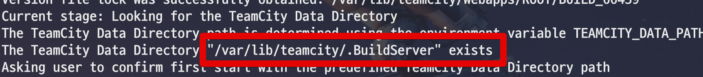
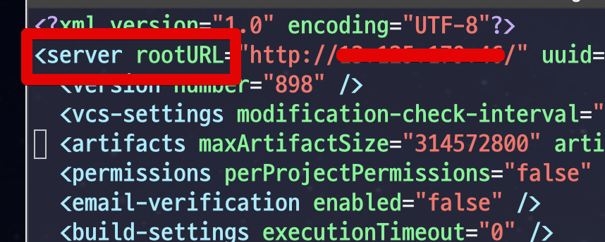
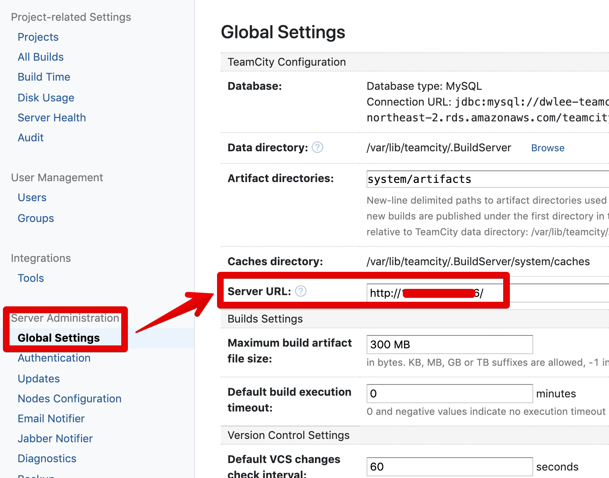

# TeamCity ServerUrl 변경

TeamCity가 설치된 서버의 도메인 주소가 변경되면 등록된 server Url을 같이 변경해주어야 합니다.  
Github OAuth의 Redirect URL등과 같이 TeamCity 서버 주소를 생성하는 기능들이 모두 예전 도메인으로 진행되기 때문인데요.  
   
해당 설정을 Web 에서는 쉽게 변경할 수 있지만, 로그인 조차 안되는 상황에선 설정파일을 직접 수정해야 합니다.  
  
그래서 여기서는 서버의 설정파일을 직접 수정하는 방법으로 진행하겠습니다.  
  
## 본문

먼저 TeamCity의 **Data Directory** (여러 설정들이 담긴 디렉토리로 보시면 됩니다) 위치를 확인합니다.  
  
보통은 ```TeamCity 설치된 위치/.BuildServer``` 입니다.  
  
해당 위치가 아니시라면 아래와 같이 로그를 통해 위치를 확인합니다. 

```bash
vim /TeamCity 설치된 위치/logs/teamcity-server.log
```



Data Directory 위치가 확인되었다면 Data Directory 에 있는 ```config/main-config.xml``` 을 열어봅니다.

```bash
vim <TeamCity data directory>/config/main-config.xml
```

xml 파일을 열어 보면 첫줄에 바로 ```<server rootURL="기존 도메인 URL"``` 을 볼 수 있습니다.



기존 도메인 URL 자리에 신규 도메인 URL을 등록하면 설정이 끝납니다.  
  
TeamCity를 재시작 하신 뒤, Administration -> Server Administration -> Global Settings -> Server URL 에서 잘 변경되었는지 확인합니다.
   



## 참고

* [configuring-server-url](https://www.jetbrains.com/help/teamcity/2019.1/configuring-server-url.html)