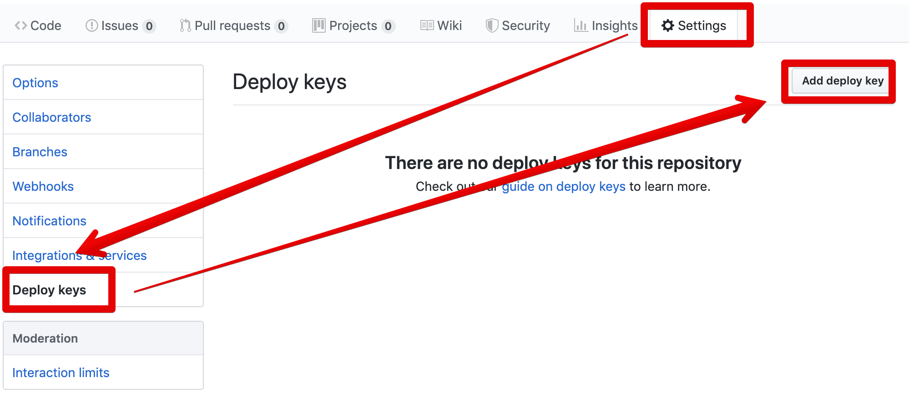
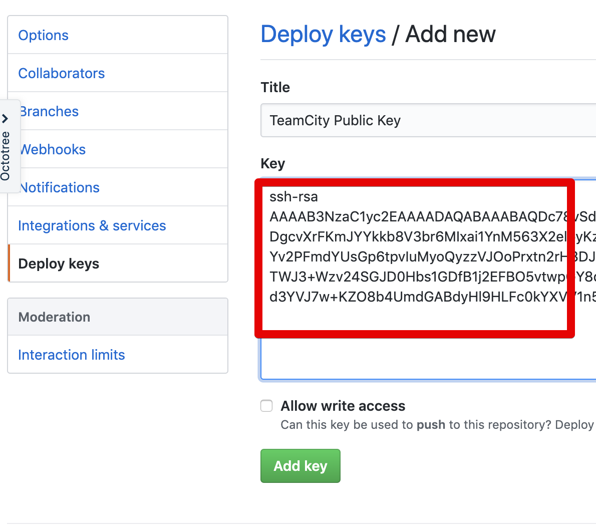
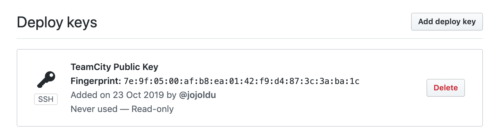

# TeamCity 에 Github 프로젝트 연동하기

> Github 프로젝트 연동을 OAuth로 할 수도 있습니다.  
> 공식 문서에서 그 방법을 이미 알려주고 있습니다만, 
> 이렇게 될 경우 OAuth 토큰을 발급한 사용자가 퇴사하거나 계정삭제를 할 경우 관리가 어렵기 때문에 ssh key로 진행하겠습니다. 

## 1. Key 생성

```bash
ps aux | grep teamcity
```

저같은 경우 이미 Teamcity 실행자를 ```teamcity```로 진행했기 때문에 실행자는 ```teamcity``` 입니다.  
  
해당 사용자로 현재 로그인 사용자를 변경하겠습니다.

```bash
sudo su - teamcity
```

```bash
mkdir ~/.ssh
```

```bash
cd ~/.ssh
```

```bash
ssh-keygen -t rsa -f ~/.ssh/github_teamcity-in-action
```

> github_teamcity-in-action 은 제가 지정한 Key명입니다.  
> 원하시는 Key명으로 지정하시면 됩니다.

비밀 번호는 **모두 입력하지 않고** 바로 Enter로 넘어갑니다.


```bash
-bash-4.2$ ls -al
total 16
drwxrwxr-x  2 teamcity teamcity 4096 Sep  8 05:42 .
drwxr-xr-x 14 teamcity teamcity 4096 Sep  8 05:39 ..
-rw-------  1 teamcity teamcity 1675 Sep  8 05:42 github_teamcity-in-action
-rw-r--r--  1 teamcity teamcity  407 Sep  8 05:42 github_teamcity-in-action.pub
```

## 2. Github에 Public Key 등록

```bash
cat github_teamcity-in-action.pub
```






