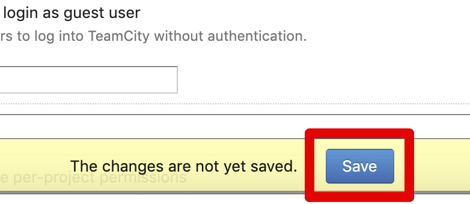

# Teamcity Github 로그인 연동

Teamcity에는 기본적인 id/password 방식의 로그인 기능이 있지만, 실제 업무에서 해당 기능은 잘 사용되지 않습니다.  
  
Github 혹은 Google 과 같은 OAuth 인증을 사용하게 되는데요.  
이번 시간에는 Teamcity 에서의 Github 로그인을 연동해보겠습니다.  

## 1. 플러그인 설치

Teamcity에서는 공식적으로 Github 로그인을 지원하지 않습니다.  

> Jenkins와 비슷합니다.

다만, 해당 기능을 플러그인으로 지원하고 있습니다.  
  
그래서 가장 먼저 플러그인 설치를 하겠습니다.  
  
먼저 설치된 Teamcity 의 관리자 페이지 (Adminstration) 으로 이동합니다.

좌측 사이드바 하단의 PluginsList 를 클릭합니다.

검색을 통한 플러그인 설치를 위해 Browse plugins repository 를 선택합니다.

IntelliJ와 마찬가지로 플러그인 검색 화면으로 이동됩니다.  
여기서 **github** 으로 검색합니다.

그럼 아래와 같이 **teamcity-oauth** 플러그인을 찾을 수 있습니다.

플러그인 상세 화면으로 가시면 **Get** 버튼이 있습니다.  
클릭하시면 아래와 같이 **Install to Teamcity주소** 선택하신뒤  

Install 버튼을 클릭합니다.

설치가 끝나시면 **Enable uploaded plugins** 버튼이 활성화됩니다.  
방금 설치한 플러그인을 **Teamcity에 가져올건지** 의미이니 바로 클릭해서 활성화시킵니다.

마지막으로 **Enable** 버튼을 클리갷서 **재시작 없이 플러그인을 적용**합니다.

플러그인 설치가 끝났습니다.  
이제 기존 Password 방식에서 Github 인증으로 로그인 방식을 교체해보겠습니다. 

### 1-2. Github 로그인으로 교체

Teamcity 좌측 사이드바의 **Authentication** 항목으로 이동합니다.

기본 설정 화면에서는 별다른 기능이 없기 때문에 **Advanced Mode**로 전환합니다.

Advanced Mode 에서는 플러그인으로 추가된 인증 방식들에 대한 설정을 추가할 수 있습니다.  
**Add Module** 버튼을 클릭해 OAuth 앱을 추가합니다.

새 모듈은 Github 로그인 모듈입니다.  
아래 그림과 같이 체크/선택 하신 뒤 ClientID와 ClientSecret가 필요하다는 것을 아실텐데요.

해당 키값들은 **Github App**에서 발급하는 것인지라 Github에서 코드를 발급 받겠습니다.  
(잠깐 새 브라우저를 열어서 진행합니다.)

## 2. Github 설정

> Github 설정은 기존에 Github OAuth 로그인을 위한 App을 만들던 방식과 동일합니다.

Github에서 본인 프로필 -> Settings 로 이동합니다.

좌측 사이드바의 **Developer settings** 로 이동합니다.

좌측 사이드바의 OAuth Apps -> New OAuth App을 차례로 클릭합니다.

Teamcity의 URL을 **Homepage와 Callback** 2곳에 모두 등록합니다.  

> 즉, 둘다 Teamcity 도메인 주소를 쓰시면 됩니다.

Register application으로 App 등록을 마무리합니다.

그럼 아래와 같이 ClientID와 ClientSecret가 발급됩니다.

이제 이 코드들을 챕터 1에서 열어둔 Teamcity 설정 화면에 등록합니다.

## 3. Teamcity에 Github App 정보 등록

* ClientID & ClientSecret
  * Github App으로 발급한 코드
* scope
  * user 만 등록

로그인을 시도한 Github 회원의 정보만 있으면 되니 scope는 user로만 합니다.  
  
여기서 **Hide login form**을 체크하시면 **기존의 id/password 방식의 로그인 버튼이 메인 화면에서 숨겨집니다.  
Github 로그인만 사용하신다면 체크해서 숨기는것도 좋습니다.  

> 전 숨겼어요.

Add 버튼을 클릭하면 화면 하단에 Save 버튼이 활성화 됩니다.  
Save 버튼을 클릭하여 설정을 저장합니다.

HTTP 인증 모듈에 Github OAuth 인증 모듈이 추가된 것을 확인합니다.

모든 설정이 다되셨다면 로그아웃 하신뒤 Teamcity 첫 페이지로 이동합니다.  
그럼 이제 아래와 같이 Github OAuth 로그인 버튼이 활성화 됩니다.

로그인을 시도해보시면 OAuth 인증 화면으로 이동하게 되고, 인증 버튼을 클릭하시면

성공적으로 로그인 하시게 됩니다.

