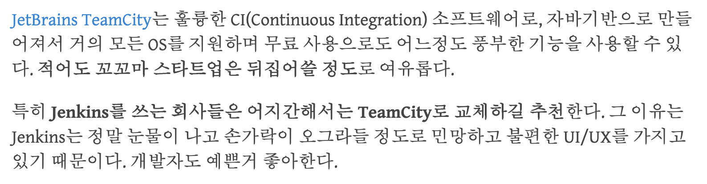

# TeamCity 설치하기

최근 들어 **스프링 배치를 수행하는 Runner로 젠킨스가 최선인가?** 라는 의문을 계속 보게 되었습니다.  
(비단 배치 수행용이 아닌 배포에서도 마찬가지로)  
  
여러 대안책을 검토 중에 젯브레인 (JetBrains) 에서 만든 Team City가 생각났습니다.  
  
여러 비교글이 있었지만, 결정적 계기는 [김영재님의 포스팅](https://youngjaekim.wordpress.com/2014/11/14/teamcity%ec%97%90%ec%84%9c-azure-websites-deploy%ed%95%98%ea%b8%b0/) 였습니다.  



전반적인 포스팅 내용들을 보면서 시작해봐도 괜찮겠다 싶어 별도의 AWS EC2에 설치해서 진행하게 되었습니다.  
TeamCity로 시작하고자 하시는 분들은 참고하셔도 좋을것 같습니다.  
  
포스팅은 Windows OS가 아닌 Linux OS에서 진행됩니다.  
명령어는 Centos 기반으로 하고 있지만, Ubntu 역시 비슷하게 사용할 수 있습니다.

## 1. 환경 확인

일단 Java 8이 설치되어 있어야 합니다.  
  
```bash
java -version
``` 

확인 후, 아래와 같이 8 버전 이상이면 그대로 진행하시면 됩니다.

```bash
openjdk version "1.8.0_222"
OpenJDK Runtime Environment (build 1.8.0_222-b10)
OpenJDK 64-Bit Server VM (build 25.222-b10, mixed mode)
```

> EC2 기본이 Java7 이라 8 설치가 필요하신 분들은 [이전 포스팅](https://jojoldu.tistory.com/261) 을 참고해보세요.
 
## 2. 설치

먼저 [TeamCity 다운로드 페이지](https://www.jetbrains.com/teamcity/download/download-thanks.html) 에서 다운로드 링크를 가져옵니다.  
  
**direct link** 를 우클릭해서 링크를 복사합니다.
   


현재 (2019.09.08 기준) 최신 버전은 2019.1.3 입니다.  


```bash
sudo mkdir /var/lib/teamcity
sudo wget https://download.jetbrains.com/teamcity/TeamCity-2019.1.3.tar.gz
```

```bash
sudo tar -xzvf TeamCity-2019.1.3.tar.gz
```

```bash
sudo cp -r /var/lib/TeamCity/* /var/lib/teamcity/
```

> ./TeamCity 디렉토리와 tar 파일은 삭제합니다. (용량이 커요)  

```bash
sudo mkdir /var/lib/teamcity/.BuildServer
```

### 사용자 추가

```bash
sudo useradd teamcity
sudo chown -R teamcity:teamcity /var/lib/teamcity/
```

사용자 Home 변경

```bash
sudo usermod -d /var/lib/teamcity teamcity
```

만약 명령어 수행시 다음과 같이 ```usermod: user teamcity is currently logged in``` 가 발생한다면 ```pkill``` 로 전체 프로세스 제거 후 다시 시도합니다.

```bash
pkill -u teamcity
```

다시 사용되는 프로세스가 있는지 확인 후

```bash
ps -ef | grep teamcity
```

없으면 usermod로 home 변경을 진행합니다. 

```bash
sudo usermod -d /var/lib/teamcity teamcity
```


### service 추가

```bash
sudo vim /etc/init.d/teamcity
```

```bash
#!/bin/bash
### BEGIN INIT INFO
# Provides:          teamcity
# Required-Start:    $local_fs
# Required-Stop:     $local_fs
# Default-Start:     2 3 4 5
# Default-Stop:      0 1 6
# Short-Description: TeamCity
# Description:       TeamCity
### END INIT INFO

TEAMCITY_USER=teamcity
TEAMCITY_DIR=/var/lib/teamcity
TEAMCITY_PATH=$TEAMCITY_DIR/bin/runAll.sh 
TEAMCITY_DATA_DIR=$TEAMCITY_DIR/.BuildServer

case $1 in

  start)
    echo "Starting Team City"
    su - $TEAMCITY_USER -c "TEAMCITY_DATA_PATH=$TEAMCITY_DATA_DIR $TEAMCITY_PATH start"
    ;;
  stop)
    echo "Stopping Team City"
    su - $TEAMCITY_USER -c "TEAMCITY_DATA_PATH=$TEAMCITY_DATA_DIR $TEAMCITY_PATH stop"
    ;;
  restart)
    echo "Restarting Team City"
    su - $TEAMCITY_USER -c "TEAMCITY_DATA_PATH=$TEAMCITY_DATA_DIR $TEAMCITY_PATH stop"
    su - $TEAMCITY_USER -c "TEAMCITY_DATA_PATH=$TEAMCITY_DATA_DIR $TEAMCITY_PATH start"
    ;;
  *)
    echo "Usage: /etc/init.d/teamcity {start|stop|restart}"
    exit 1
    ;;
esac

exit 0
```

```bash
sudo chmod +x /etc/init.d/teamcity
```

```bash
sudo chkconfig --add teamcity
```

## 실행

```bash
proxy_pass http://localhost:8111;
proxy_set_header X-Real-IP $remote_addr;
proxy_set_header X-Forwarded-For $proxy_add_x_forwarded_for;
proxy_set_header Host $http_host;
```
## DB?
빌드 이력, 사용자, 빌드 결과 및 일부 런타임 데이터를 SQL 데이터베이스에 저장합니다. 수동 백업 및 복원 페이지 에서 저장되는 내용에 대한 설명도 참조 하십시오.

```sql
create database teamcity;
```

```sql
show databases;
```


