# TeamCity 설치하기

최근 들어 **스프링 배치를 수행하는 Runner로 젠킨스가 최선인가?** 라는 의문을 계속 보게 되었습니다.  
(비단 배치 수행용이 아닌 배포에서도 마찬가지로)  
  
여러 대안책을 검토 중에 젯브레인 (JetBrains) 에서 만든 Team City가 생각났습니다.  
  
여러 비교글이 있었지만, 결정적 계기는 [김영재님의 포스팅](https://youngjaekim.wordpress.com/2014/11/14/teamcity%ec%97%90%ec%84%9c-azure-websites-deploy%ed%95%98%ea%b8%b0/) 였습니다.  


전반적인 포스팅 내용들을 보면서 시작해봐도 괜찮겠다 싶어 별도의 AWS EC2에 설치해서 진행하게 되었습니다.  
TeamCity로 시작하고자 하시는 분들은 참고하셔도 좋을것 같습니다.  
  
포스팅은 Windows OS가 아닌 Linux OS에서 진행됩니다.  
명령어는 Centos 기반으로 하고 있지만, Ubntu 역시 비슷하게 사용할 수 있습니다.

## 1. 환경 확인

일단 Java 8이 설치되어 있어야 합니다.  
  
```bash
java -version
``` 

확인 후, 아래와 같이 8 버전 이상이면 그대로 진행하시면 됩니다.

```bash
openjdk version "1.8.0_222"
OpenJDK Runtime Environment (build 1.8.0_222-b10)
OpenJDK 64-Bit Server VM (build 25.222-b10, mixed mode)
```

> EC2 기본이 Java7 이라 8 설치가 필요하신 분들은 [이전 포스팅](https://jojoldu.tistory.com/261) 을 참고해보세요.
 
## 2. 설치

먼저 [TeamCity 다운로드 페이지](https://www.jetbrains.com/teamcity/download/download-thanks.html) 에서 다운로드 링크를 가져옵니다.  
  
**direct link** 를 우클릭해서 링크를 복사합니다.
   
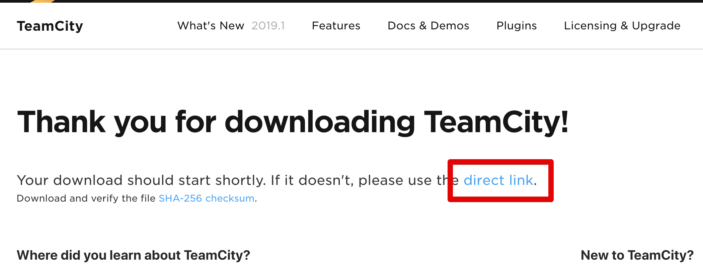

> 현재 (2019.09.08 기준) 최신 버전은 2019.1.3 입니다.  

wget으로 복사한 링크를 다운 받습니다.

```bash
sudo wget https://download.jetbrains.com/teamcity/TeamCity-2019.1.3.tar.gz
```

다운 받은 ```tar.gz``` 파일의 압축을 해제합니다.

```bash
sudo tar -xzvf TeamCity-2019.1.3.tar.gz
```

압축을 해제하면 ```TeamCity``` 라는 디렉토리가 생성됩니다.    
해당 디렉토리의 내용들을 신규로 생성한 ```teamcity``` 디렉토리로 복사합니다.

```bash
sudo mkdir /var/lib/teamcity
sudo cp -r /var/lib/TeamCity/* /var/lib/teamcity/
```

* ```mkdir /var/lib/teamcity```
    * teamcity를 nginx나 jenkins처럼 관리하기 위해 ```/var/lib``` 디렉토리에 신규로 생성합니다.
    * ```/var/lib``` 권한이 root라서 ```sudo```를 사용합니다.

> 복사가 다 되셨다면  ./TeamCity 디렉토리와 tar 파일은 삭제합니다. (용량이 커요)  

복사가 끝났다면 추가로 하나의 디렉토리를 더 생성합니다.  

```bash
sudo mkdir /var/lib/teamcity/.BuildServer
```

* ```.BuildServer```
    * TeamCity의 Data 들을 담아놓은 별도의 디렉토리입니다.
    * 여러 설정들이 담긴 디렉토리로 보시면 됩니다.

여기까지 다 되셨다면 파일 설치는 끝이납니다.  
TeamCity를 ```Linux Service```로 추가하기 위해 몇가지 장치를 진행해보겠습니다.

### 2-1. 사용자 추가

teamcity라는 사용자를 추가해서 모든 실행 권한을 위임하겠습니다.  
ec2-user, root 등은 너무 강력한 권한이기도 하고, ```sudo``` 권한을 가지고 있어 위험합니다.  
  
그래서 TeamCity 역시 별도의 ```teamcity``` 사용자를 생성해서 관리하겠습니다.

> nginx, jenkins 역시 설치해서 사용해보시면 각자의 사용자 권한으로 실행하는 것을 확인할 수 있습니다.

아래 명령어를 차례로 입력합니다.

```bash
sudo useradd teamcity
sudo chown -R teamcity:teamcity /var/lib/teamcity/
```

* ```sudo useradd teamcity```
    * teamcity 사용자를 추가합니다.
* ```sudo chown -R teamcity:teamcity /var/lib/teamcity/```
    * ```/var/lib/teamcity/``` 를 포함하여 하위 디렉토리, 파일들의 소유 권한을 모두 ```teamcity``` 로 변경합니다.
    * ```-R``` 옵션으로 **하위에 있는 모든 디렉토리, 파일을 대상**으로 합니다.    

현재 상태에서 teamcity 사용자의 Home 위치는 ```/home/teamcity``` 입니다.  
teamcity 사용자는 항상 teamcity 관련된 내용만 담당할거라 Home 위치를 TeamCity가 설치된 ```/var/lib/teamcity```로 변경하겠습니다.  

```bash
sudo usermod -d /var/lib/teamcity teamcity
```

만약 명령어 수행시 다음과 같이 ```usermod: user teamcity is currently logged in``` 가 발생한다면 ```pkill``` 로 전체 프로세스 제거 후 다시 시도합니다.

```bash
pkill -u teamcity
```

다시 사용되는 프로세스가 있는지 확인 후

```bash
ps -ef | grep teamcity
```

없으면 usermod로 home 변경을 진행합니다. 

```bash
sudo usermod -d /var/lib/teamcity teamcity
```

Home이 변경되었다면 teamcity 계정으로 전환 후

```bash
sudo su - teamcity
```

현재 위치를 확인해봅니다.

```bash
-bash-4.2$ pwd
/var/lib/teamcity
```

/var/lib/teamcity 로 되어있는게 확인된다면 정상적으로 완료된 것입니다.

### 2-2. Service 추가

ec2-user 나 혹은 root와 같이 ```sudo``` 권한을 가진 계정으로 전환 후, ```/etc/init.d/``` 에 service를 추가하겠습니다.  
  
teamcity 파일을 생성하시고

```bash
sudo vim /etc/init.d/teamcity
```

아래 코드를 그대로 사용합니다.

```bash
#!/bin/bash
### BEGIN INIT INFO
# Provides:          teamcity
# Required-Start:    $local_fs
# Required-Stop:     $local_fs
# Default-Start:     2 3 4 5
# Default-Stop:      0 1 6
# Short-Description: TeamCity
# Description:       TeamCity
### END INIT INFO

TEAMCITY_USER=teamcity
TEAMCITY_DIR=/var/lib/teamcity
TEAMCITY_PATH=$TEAMCITY_DIR/bin/runAll.sh
TEAMCITY_DATA_DIR=$TEAMCITY_DIR/.BuildServer

case $1 in

  start)
    echo "Starting Team City"
    su - $TEAMCITY_USER -c "TEAMCITY_DATA_PATH=$TEAMCITY_DATA_DIR $TEAMCITY_PATH start"
    ;;
  stop)
    echo "Stopping Team City"
    su - $TEAMCITY_USER -c "TEAMCITY_DATA_PATH=$TEAMCITY_DATA_DIR $TEAMCITY_PATH stop"
    ;;
  restart)
    echo "Restarting Team City"
    su - $TEAMCITY_USER -c "TEAMCITY_DATA_PATH=$TEAMCITY_DATA_DIR $TEAMCITY_PATH stop"
    su - $TEAMCITY_USER -c "TEAMCITY_DATA_PATH=$TEAMCITY_DATA_DIR $TEAMCITY_PATH start"
    ;;
  *)
    echo "Usage: /etc/init.d/teamcity {start|stop|restart}"
    exit 1
    ;;
esac

exit 0
```

* ```### BEGIN INIT INFO ~ ### END INIT INFO```
    * 없으면 ```chkconfig``` 에 추가되지 않습니다.
    * 주석이라고 빼시면 안됩니다.
* 미리 만들어둔 ```.BuildServer```을 환경변수로 사용하여 ```runAll.sh``` 스크립트를 실행합니다.
    * start, stop, restart 으로 이루어져있습니다.

스크립트 파일 생성을 완료 하셨다면 **실행 권한**을 추가합니다.

```bash
sudo chmod +x /etc/init.d/teamcity
```

chkconfig 에 teamcity 를 등록합니다.

```bash
sudo chkconfig --add teamcity
```

서비스 등록이 완료 되었습니다.  
이제 아래와 같은 service 명령어로 TeamCity를 관리할 수 있게 되었습니다.

```bash
sudo service teamcity start
```

### 2-3. Nginx 설치 및 연동

TeamCity의 기본 포트는 8111입니다.  
80포트로 리버스 프록시, 정적 파일 (css/js/image 등)캐시, Let's Encrypt 를 통한 SSL 등록 등 여러가지 확장 포인트를 가질 수 있도록 Nginx을 설치하겠습니다.  
  
> [이전 포스팅](https://jojoldu.tistory.com/441) 의 챕터 3을 보시면 Nginx 설치 방법이 나옵니다.

설치된 Nginx의 ```nginx.conf``` 을 열어 아래와 같이 ```http://localhost:8111``` 로 프록시 설정을 합니다.
 
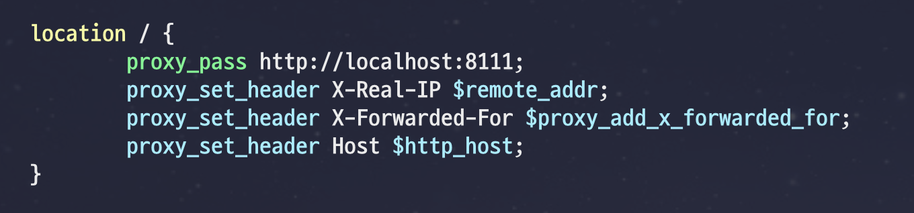

```bash
proxy_pass http://localhost:8111;
proxy_set_header X-Real-IP $remote_addr;
proxy_set_header X-Forwarded-For $proxy_add_x_forwarded_for;
proxy_set_header Host $http_host;
```

Nginx 를 실행하여 TeamCity로 프록시 되는 것을 확인하셨다면 성공입니다.

## 3. 실행

아래 명령어로 TeamCity가 실행되었다면

```bash
sudo service teamcity start
```

브라우저를 열어 접속해봅니다.  
(Nginx가 있어 80포트로 접속하시면 됩니다.)  
  
앞서 등록한 ```.BuildServer``` 가 잘 등록되어있는 것을 확인 하신뒤, Proceed 버튼을 클릭합니다.

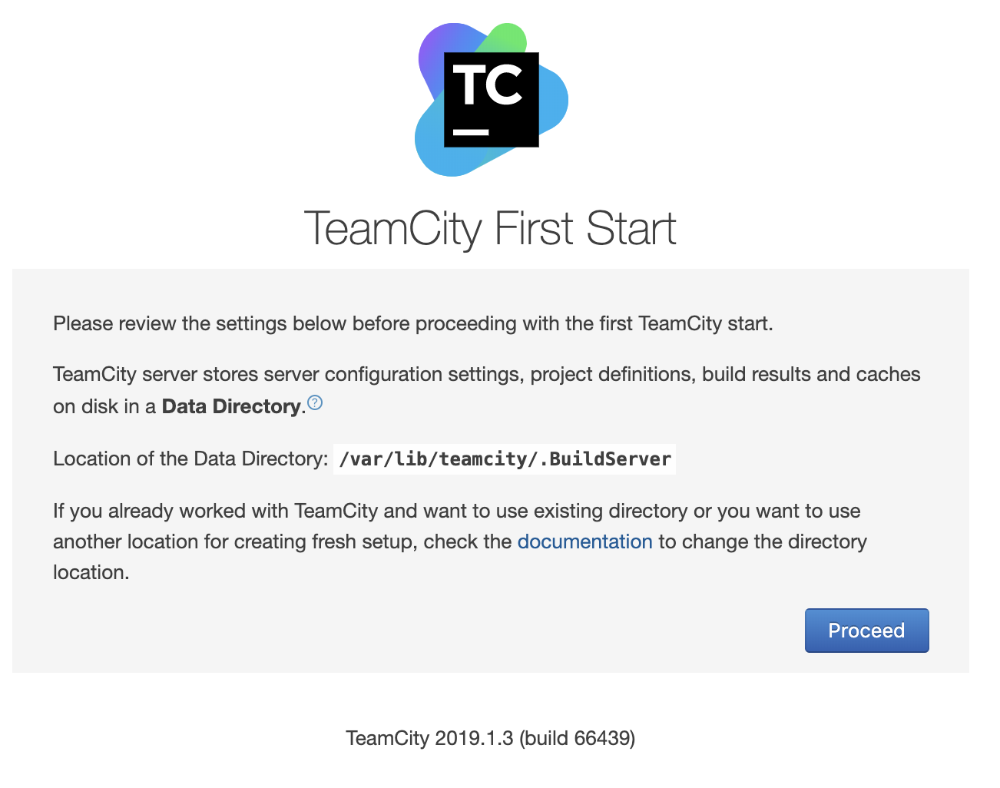

데이터베이스 타입을 선택하는 화면이 나옵니다.  

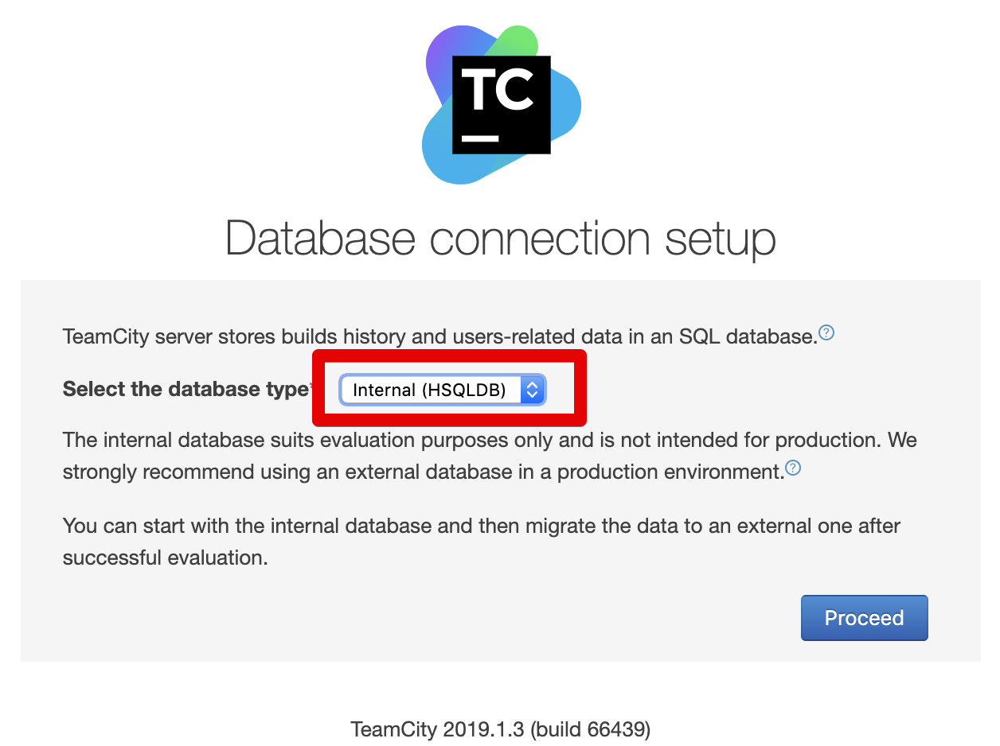

TeamCity는 젠킨스와 달리 빌드 이력/사용자 정보/빌드 결과/일부 런타임 데이터 등을 **RDB에 저장**합니다.  
외부의 데이터베이스나 같은 서버에 설치된 데이터베이스 모두를 사용할 수 있기 때문에 **데이터의 백업과 관리에 좋습니다**.  
  
설치된게 없다면 TeamCity에서 내장형으로 제공하는 HSQLDB를 사용하면 됩니다.  
다만, 여기에서는 **실제로 서비스 가능한 수준**을 생각하기 때문에 외부에 설치된 MySQL을 사용하겠습니다.  

사용할 MySQL이 있으신 분들은 3-1로, 없으신 분들은 HSQLDB를 선택하신뒤 3-2로 바로 가시면 됩니다.

### 3-1. MySQL 연동

> 3-1은 본인이 사용할 MySQL이 있다는 가정 하에 진행됩니다.  

데이터베이스 타입을 MySQL로 선택하시면 **Download JDBC driver** 항목이 나옵니다.  
JDBC 드라이버를 다운 받습니다.  

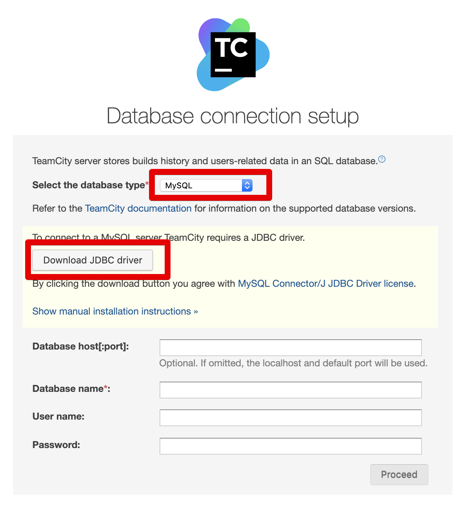

본인의 MySQL 접속 정보를 등록하면 됩니다.  
저 같은 경우 database 도 별도로 생성해서 사용합니다.  
teamcity 라는 이름의 database를 생성하고 이를 TeamCity 전용 스키마들만 담도록 합니다.

```sql
create database teamcity;
```

잘 생성되었는지 확인합니다.

```sql
show databases;
```


나머지 접속 정보들을 모두 등록합니다.

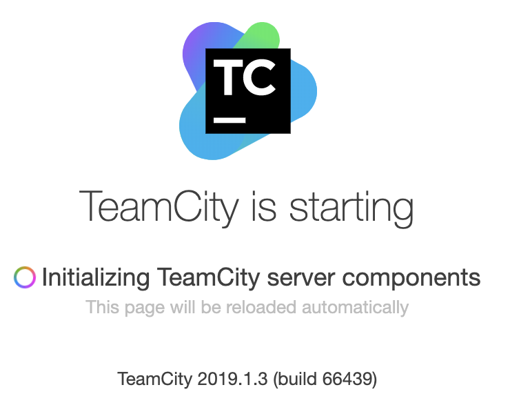

설치가 다 끝난 뒤 ```show tables```로 확인해보시면 TeamCity 관련 스키마들이 자동 생성된 것을 확인할 수 있습니다.

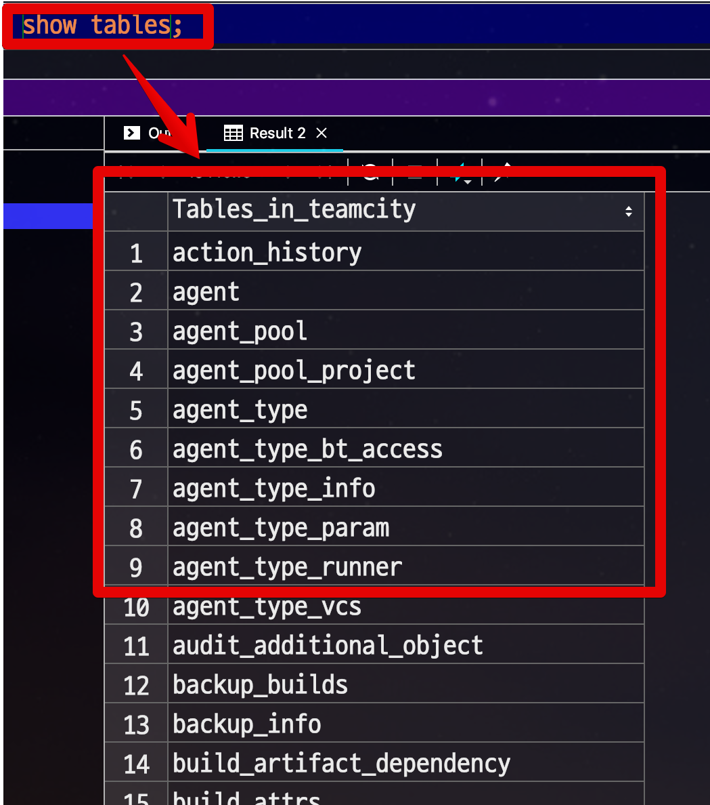

DB 관련 설정이 끝나셨으면 Proceed 버튼을 눌러 다음으로 진행합니다.

### 3-2. 첫번째 로그인

DB 관련 설정이 끝나시면 아래와 같이 TeamCity 초기화 작업이 진행됩니다.

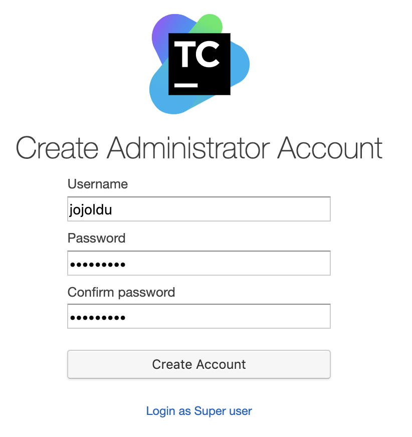

초기화 작업이 끝나면 라이센스 동의 화면이 나옵니다.  
**Accept license agreement** 를 체크하고 Continue 버튼을 클릭합니다.

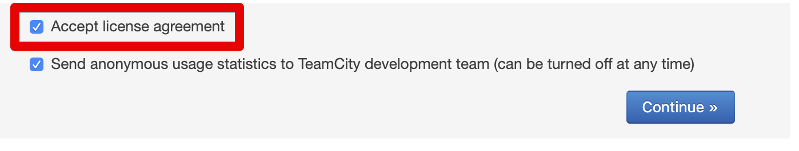

최초 관리자 계정 생성 화면이 나옵니다.  
관리자 계정 정보를 등록하고 **Create Account** 를 클릭하여 생성합니다.


생성 되는 즉시 로그인 됩니다.  
  
로그인 하시면 계정 정보 변경 페이지로 자동 이동되는데, 이는 관리자 계정의 경우 이메일 주소 등록이 필수라 그렇습니다.  
  
관리자 계정의 이메일을 등록하신뒤 Save 버튼을 클릭해 저장합니다.

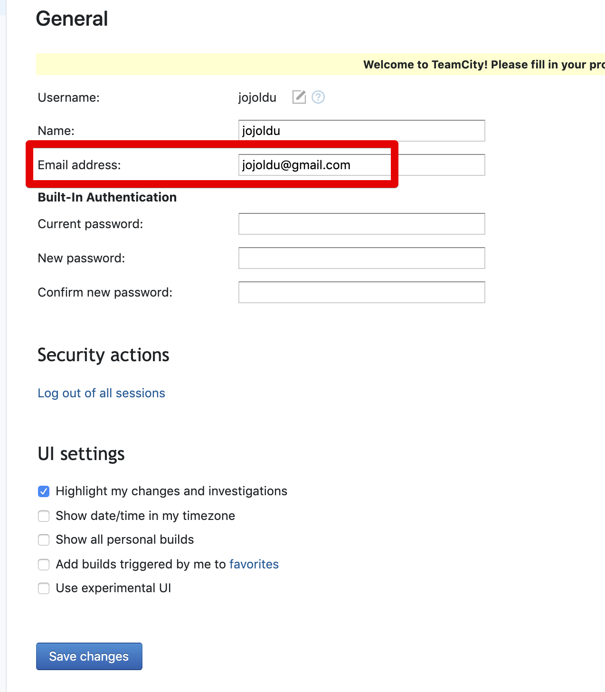

여기까지 하시면 모든 설치 과정이 끝나고 아래와 같이 TeamCity 메인 페이지를 보실 수 있습니다.

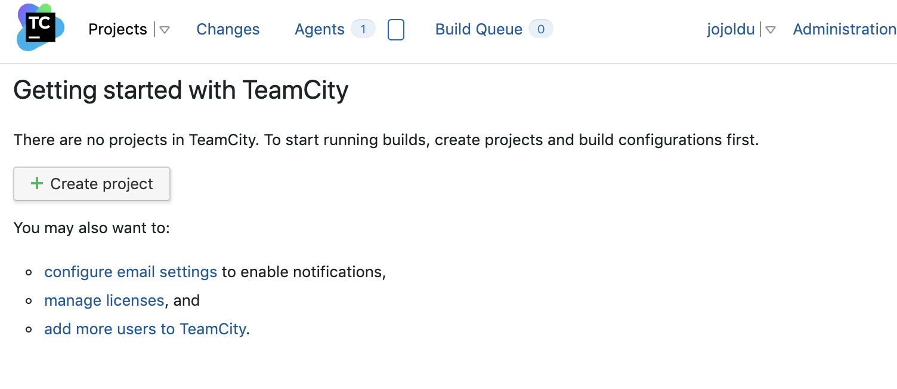

## 마무리

모든 설치과정이 끝났습니다.  
[공식 문서](https://www.jetbrains.com/help/teamcity/teamcity-documentation.html) 가 잘 되어 있어 필요하신 내용들을 찾아서 보시기에 크게 어려움은 없으실것 같습니다.  
  
이후 필요한 내용들은 제가 테스트 해보면서 차근차근 추가될 예정입니다.

* Github 로그인
* Github 프로젝트 연동
* IntelliJ IDE와 연동
  
그럼 다음 글에서 또 뵙겠습니다.  
감사합니다!