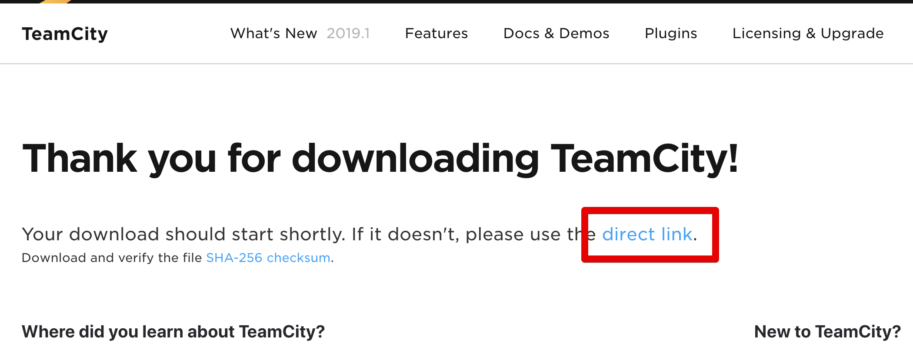
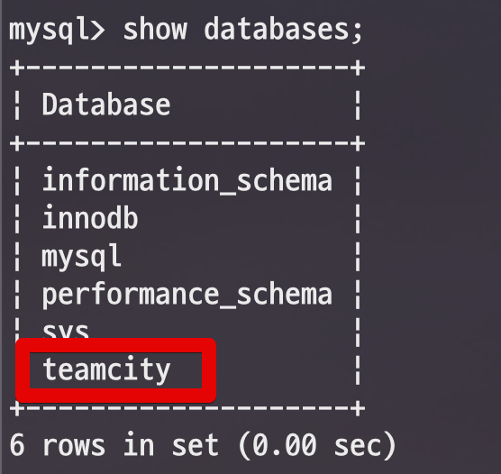

# Team City 설치

Windows OS가 아닌 Linux OS에서 진행됩니다.  
명령어는 Centos 기반으로 하고 있지만, Ubntu 역시 비슷하게 사용할 수 있습니다.

## 1. 환경 확인

일단 Java 8이 설치되어 있어야 합니다.  
  
```bash
java -version
``` 

```bash
openjdk version "1.8.0_222"
OpenJDK Runtime Environment (build 1.8.0_222-b10)
OpenJDK 64-Bit Server VM (build 25.222-b10, mixed mode)
```
## 2. 설치

[설치 페이지](https://www.jetbrains.com/teamcity/download/download-thanks.html)




```bash
sudo mkdir /var/lib/teamcity
sudo wget https://download.jetbrains.com/teamcity/TeamCity-2019.1.3.tar.gz
```

```bash
sudo tar -xzvf TeamCity-2019.1.3.tar.gz
```

```bash
sudo cp -r /var/lib/TeamCity/* /var/lib/teamcity/
```

> ./TeamCity 디렉토리와 tar 파일은 삭제합니다. (용량이 커요)  

```bash
sudo mkdir /var/lib/teamcity/.BuildServer
```

### 사용자 추가

```bash
sudo useradd teamcity
sudo chown -R teamcity:teamcity /var/lib/teamcity/
```
### service 추가

```bash
sudo vim /etc/init.d/teamcity
```

```bash
#!/bin/bash
### BEGIN INIT INFO
# Provides:          teamcity
# Required-Start:    $local_fs
# Required-Stop:     $local_fs
# Default-Start:     2 3 4 5
# Default-Stop:      0 1 6
# Short-Description: TeamCity
# Description:       TeamCity
### END INIT INFO

TEAMCITY_USER=teamcity
TEAMCITY_DIR=/var/lib/teamcity
TEAMCITY_PATH=$TEAMCITY_DIR/bin/runAll.sh 
TEAMCITY_DATA_DIR=$TEAMCITY_DIR/.BuildServer

case $1 in

  start)
    echo "Starting Team City"
    su - $TEAMCITY_USER -c "TEAMCITY_DATA_PATH=$TEAMCITY_DATA_DIR $TEAMCITY_PATH start"
    ;;
  stop)
    echo "Stopping Team City"
    su - $TEAMCITY_USER -c "TEAMCITY_DATA_PATH=$TEAMCITY_DATA_DIR $TEAMCITY_PATH stop"
    ;;
  restart)
    echo "Restarting Team City"
    su - $TEAMCITY_USER -c "TEAMCITY_DATA_PATH=$TEAMCITY_DATA_DIR $TEAMCITY_PATH stop"
    su - $TEAMCITY_USER -c "TEAMCITY_DATA_PATH=$TEAMCITY_DATA_DIR $TEAMCITY_PATH start"
    ;;
  *)
    echo "Usage: /etc/init.d/teamcity {start|stop|restart}"
    exit 1
    ;;
esac

exit 0
```

```bash
sudo chmod +x /etc/init.d/teamcity
```

```bash
sudo chkconfig --add teamcity
```

## 실행

```bash
proxy_pass http://localhost:8111;
proxy_set_header X-Real-IP $remote_addr;
proxy_set_header X-Forwarded-For $proxy_add_x_forwarded_for;
proxy_set_header Host $http_host;
```
## DB?
빌드 이력, 사용자, 빌드 결과 및 일부 런타임 데이터를 SQL 데이터베이스에 저장합니다. 수동 백업 및 복원 페이지 에서 저장되는 내용에 대한 설명도 참조 하십시오.

```sql
create database teamcity;
```

```sql
show databases;
```


