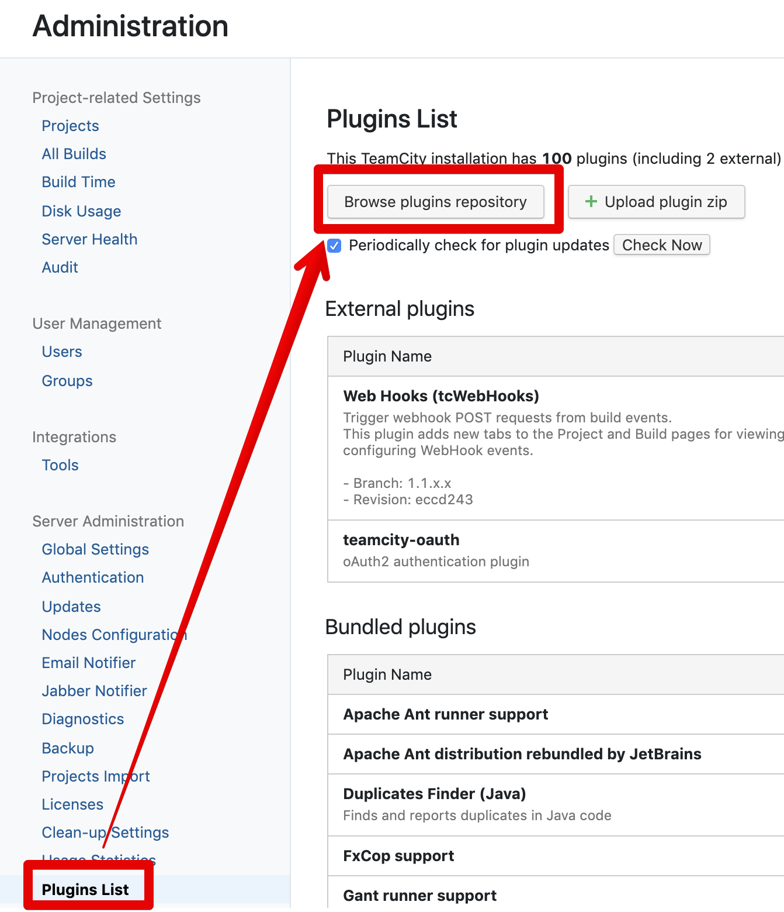
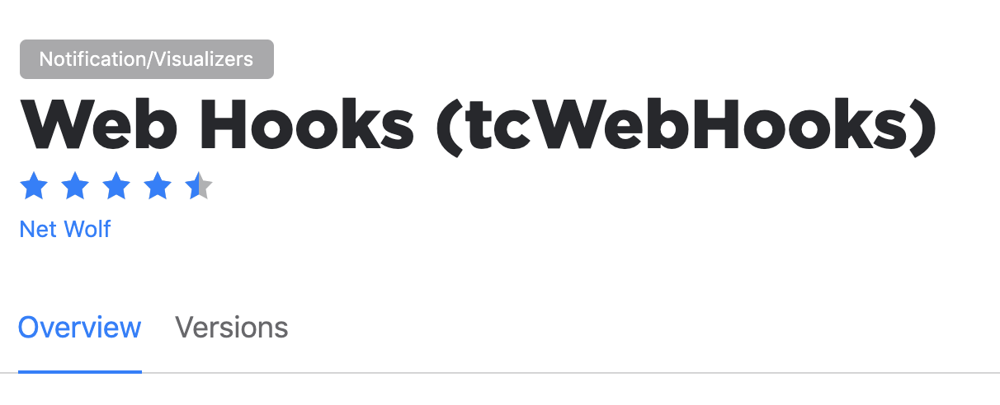

# TeamCity 빌드 실패시 결과 Slack으로 알람 받기

Teamcity에서는 공식적으로 Slack Notifier를 지원하진 않습니다.  
> 이건 젠킨스도 마찬가지라서 플러그인 설치를 해야하는것은 동일합니다.
> 다만 Teamcity에서는 공식적으로 **IntelliJ IDEA 에서 결과 알람**을 받을 수 있도록 지원하고 있습니다.
> 이 부분은 이후에 소개드리겠습니다.

Teamcity의 알람을 Slack으로 받을 수 있는 여러 플러그인들이 존재합니다만, 여기서는 Slack Notifier 플러그인들 보다는 **웹훅 플러그인**을 사용합니다.  
  
Slack Notifier 플러그인들의 경우 다음의 문제점들을 경험했는데요.

* 설치시 Zip파일을 직접 Upload 해야하는 방식
  * Slack Notifier Plus
* Slack 외에 다른 알람 연동시 어차피 Webhook이 필요함

그래서 여기에서도 역시 **웹훅 플러그인** 으로 진행해보겠습니다.

## 1. Plugin 설치

먼저 Teamcity에 웹훅 플러그인을 설치하겠습니다.  
  
관리자 화면에서 플러그인 검색 페이지로 이동합니다.

Web Hooks 플러그인을 검색해서 설치합니다.

설치가 다 되시면 아래와 같이 **Enable** 항목이 활성화 되는데, 버튼을 클릭해 WebHook 플러그인을 활성화합니다.

## 2. Slack 웹훅 개설

## 3. 웹훅 설정

## 참고

* [teamcity-build-state-notifications-in-slack](http://source.technology/teamcity-build-state-notifications-in-slack)