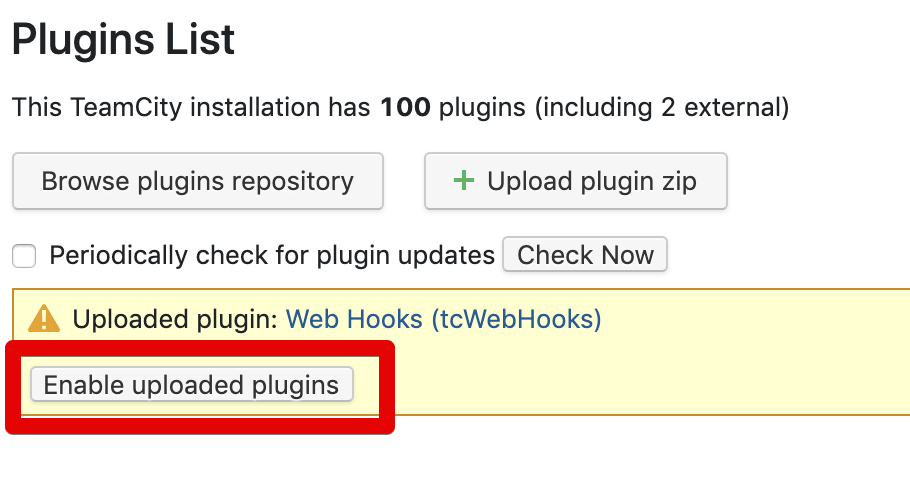
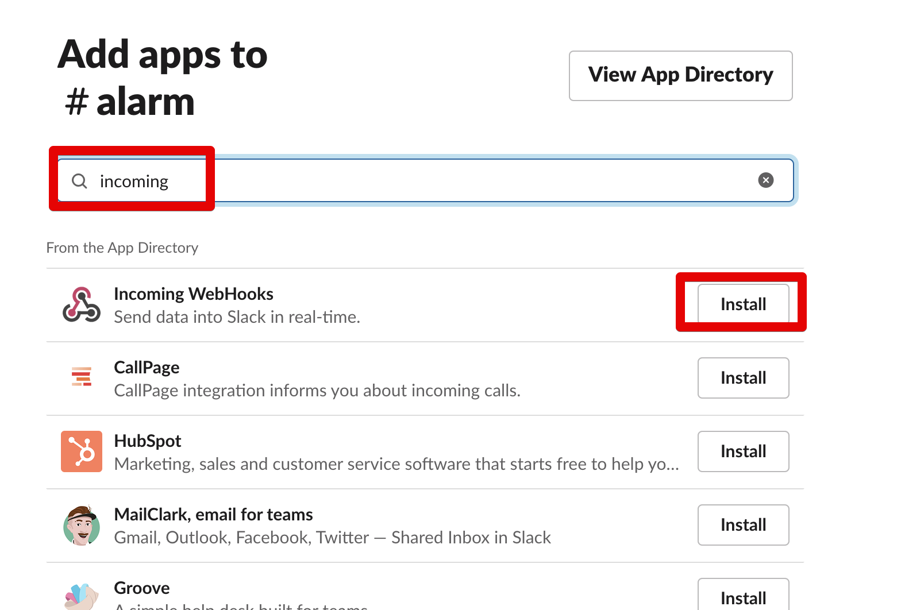
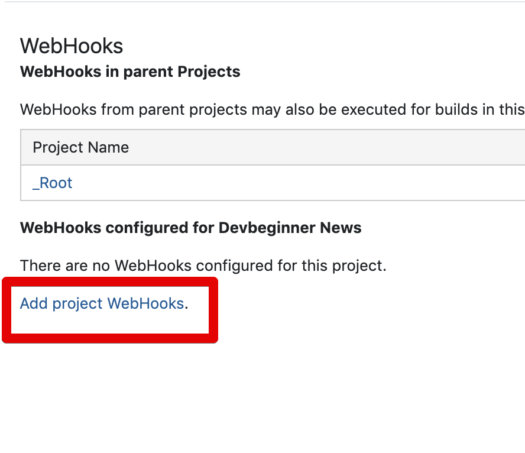

# TeamCity 빌드 실패시 결과 Slack으로 알람 받기

Teamcity에서는 공식적으로 Slack Notifier를 지원하진 않습니다.  
> 이건 젠킨스도 마찬가지라서 플러그인 설치를 해야하는것은 동일합니다.
> 다만 Teamcity에서는 공식적으로 **IntelliJ IDEA 에서 결과 알람**을 받을 수 있도록 지원하고 있습니다.
> 이 부분은 이후에 소개드리겠습니다.

Teamcity의 알람을 Slack으로 받을 수 있는 여러 플러그인들이 존재합니다만, 여기서는 Slack Notifier 플러그인들 보다는 **웹훅 플러그인**을 사용합니다.  
  
Slack Notifier 플러그인들의 경우 다음의 문제점들을 경험했는데요.

* 설치시 Zip파일을 직접 Upload 해야하는 방식
  * Slack Notifier Plus
* Slack 외에 다른 알람 연동시 어차피 Webhook이 필요함

그래서 여기에서도 역시 **웹훅 플러그인** 으로 진행해보겠습니다.

## 1. Plugin 설치

먼저 Teamcity에 웹훅 플러그인을 설치하겠습니다.  
  
관리자 화면에서 플러그인 검색 페이지로 이동합니다.


Web Hooks 플러그인을 검색해서 설치합니다.  

> 아래와 같이 Net Wolf가 만든 플러그인이어야 합니다.


설치가 다 되시면 아래와 같이 **Enable** 항목이 활성화 되는데, 버튼을 클릭해 WebHook 플러그인을 활성화합니다.



설치가 다 되셨다면 다음으로 넘어가겠습니다.

## 2. Slack 웹훅 개설

당연히 다들 아시겠지만, 슬랙에서는 특정 채널에 원하는 메세지를 대신 발송해주는 API를 제공하는데 이를 웹훅이라 합니다.  
  
그래서 이번엔 팀시티가 메세지를 전달할 슬랙의 웹훅을 개설해보겠습니다.  
  
알람을 수신할 슬랙 그룹으로 이동하신뒤, **아무 채널**이나 입장하셔서 **Add an app**을 클릭합니다.


등록 가능한 App을 검색할 수 있는데, 여기서 incoming으로 검색하여 **Incoming WwebHooks**를 Install 합니다.



바로 Add to Slack을 하여 **해당 슬랙 그룹에 새로운 웹훅 앱**을 개설합니다.


새로 만든 웹훅 앱의 필수정보들을 기개해야합니다.  
먼저 **어느 채널로 메세지를 발송할지** 선택합니다.  


기재하신뒤 **Add Incoming WehbHooks integration**을 클릭하시면 아래와 같이 **웹훅 URL**이 생성된 것을 확인할 수 있습니다.


해당 URL은 잘 보관하셔서 아래 팀시티 웹훅 설정에서 사용하겠습니다.

## 3. 웹훅 플러그인 사용하기

실패 알람을 사용하고 싶은 프로젝트의 설정창으로 이동합니다.


플러그인이 정상적으로 설치되어있다면 좌측 사이드바에 **WebHooks** 항목이 있을것입니다.  
해당 메뉴를 클릭합니다.


웹훅 설정 화면에서는 **Add project WebHooks**를 클릭하여 웹훅 생성을 시작합니다.



등록된 웹훅인 하나도 없다면 빈 목록이 보일텐데, 빈 목록을 클릭하면 웹훅 생성 메뉴가 등장합니다.


본격적으로 웹훅 설정을 진행합니다.  
WebHook Config 메뉴를 하나씩 채웁니다.


* URL
  * 2장에서 생성한 슬랙 웹훅 API 주소를 등록합니다.
  * 메뉴 제일 하단에 **Trigger when ~~** 조건 달성시 호출됩니다.
* Payload Format
  * 플러그인 초기에는 슬랙 웹훅의 Request JSON 을 직접 등록해야만 했습니다.
  * 현재는 기본 템플릿으로 제공하기 때문에 해당 템플릿을 그대로 사용하시면 됩니다.
  * 기본 템플릿에서는 다음의 항목을 메세지로 전달합니다.
    * 빌드 상태 / 프로젝트명 / 빌드명 / 최신커밋번호 / 빌드 실행자 / Agent
    * 이외 다른 내용을 메세지에 담고 싶다면 레거시 JSON 포맷을 선택해 직접 만드시면 됩니다.
* Trigger when build is Successful
  * **성공시 웹훅을 호출**합니다.
  * ```Only trigger when ~~ Failure to Success``` 는 **이전 빌드가 실패인데, 이번 빌드에서 성공한 경우에만** 웹훅을 호출하겠다는 의미입니다.
    * 이 경우엔 상황에 따라 체크할 수 있습니다.
* Trigger when build Fails
  * **실패시 웹훅을 호출**합니다.
  * ```Only trigger when ~~ Success to Failure``` 항목은 **이전 빌드가 성공인데, 이번 빌드는 실패**일때만 보내겠다는 의미입니다. 실패는 모두 알람 받는게 좋으니 체크하지 않습니다.

모든 설정이 잘 되셨다면, **일부러 빌드를 실패해봅니다**.  
(위에서 실패시에만 웹훅을 호출하도록 체크했기 때문에 확인하려면 실패시켜야만 합니다.)  
  
아래와 같이 잘 도착한다면 모든 웹훅 설정이 잘 된 것입니다. 


## 참고

* [teamcity-build-state-notifications-in-slack](http://source.technology/teamcity-build-state-notifications-in-slack)